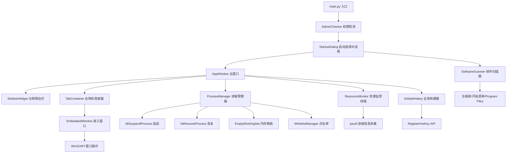

## 产品概述

构建一个 Windows 桌面应用，实现类似苹果墓碑机制的进程管理器，将用户所选软件聚合到一个窗口中统一管理。优先实现 Windows 版本，后续适配 Mac。

## 核心功能

### 1. 软件管理

- 启动时自动扫描 Windows 开始菜单及已安装软件，弹出选择框供用户勾选本次要打开的软件
- 支持手动添加任意软件/进程（通过浏览可执行文件）
- 左侧侧边栏展示所有已添加软件的图标，点击切换右侧标签页
- 支持从侧边栏移除软件（增删管理）

### 2. 墓碑机制（核心）

- 切换标签时，自动冻结所有非当前标签的软件进程（挂起所有线程 + EmptyWorkingSet 释放物理内存）
- 切回标签时，瞬间恢复进程（恢复所有线程，内存按需从页面文件换回）
- 白名单功能：用户可设置任意软件永不冻结（如微信、QQ），确保消息正常接收
- 冻结/恢复过程全程异常捕获，不影响主程序稳定性

### 3. 窗口嵌入

- 启动软件后，将其窗口嵌入到统一容器的对应标签页中
- 自动去除原软件的标题栏和边框（SetWindowLongPtr 修改窗口样式）
- 窗口大小自适应，主窗口拉伸时嵌入的软件窗口自动跟随缩放

### 4. 资源监控

- 实时显示每个软件的 CPU 占用率、内存占用（物理内存 + 虚拟内存）
- 在侧边栏每个软件图标旁显示资源占用微型指示器

### 5. 全局快捷键

- 固定唤醒指定软件（如千问语音）：按全局快捷键（默认 Ctrl+Alt+Q）唤醒目标软件并切换到对应标签
- 唤醒的软件使用完毕后，切换走时自动冻结（除非在白名单）

### 6. 其他要求

- 启动时自动检测并请求管理员权限（冻结进程需要）
- 所有异常均捕获，主程序不会崩溃
- 代码注释中写明所有依赖及安装方式
- 生成完整可直接运行的单文件 Python 代码（main.py）

## 技术栈选择

- **语言**: Python 3.10+
- **UI 框架**: PySide6（Qt6 Python 绑定，原生美观，支持窗口嵌入）
- **Windows API**: pywin32 + ctypes（进程线程管理、窗口操作、内存管理、全局快捷键）
- **进程信息**: psutil（跨平台进程信息查询，CPU/内存监控）
- **管理员权限**: ctypes + shell32.ShellExecuteW（UAC 提权）

## 实施方案

#### 1. 进程冻结/恢复方案（AI 选型最稳定方案）

采用 **NtSuspendProcess / NtResumeProcess 组合方案**：

- **CPU 冻结**: 优先调用 `NtSuspendProcess`（最彻底，整进程挂起），若不可用则回退到枚举所有线程调用 `SuspendThread`
- **内存释放**: 调用 `EmptyWorkingSet`（通过 `psutil.Process().memory_info()` 配合 `SetProcessWorkingSetSize(-1,-1)` 等效实现），强制将进程工作集清空，物理内存释放到页面文件
- **恢复**: 调用 `NtResumeProcess` 或逐个 `ResumeThread`
- **白名单绕过**: 白名单中的进程跳过上述两步，不做任何处理
- **异常兜底**: 每步均 try/except，失败时记录并继续，不影响主程序

#### 2. 窗口嵌入方案

- 启动子进程后，通过 `FindWindow` / `EnumWindows` 找到目标窗口句柄（通过进程 ID 匹配）
- 调用 `SetParent(hwnd, container_hwnd)` 将子窗口嵌入容器
- 调用 `SetWindowLongPtr` 移除 `WS_CAPTION`、`WS_THICKFRAME`、`WS_SYSMENU`、`WS_MINIMIZEBOX`、`WS_MAXIMIZEBOX` 样式
- 调用 `SetWindowPos` 触发样式刷新
- 监听主窗口 resize 事件，同步调整所有嵌入子窗口大小

#### 3. 管理员权限方案

- 启动时调用 `ctypes.windll.shell32.IsUserAnAdmin()` 检测权限
- 若非管理员，调用 `ShellExecuteW` 以 `runas` 参数重新启动自身，退出当前实例
- 若用户拒绝提权，给出提示但继续以普通权限运行（部分功能受限，标注提示）

#### 4. 软件扫描方案

- 扫描注册表 `HKEY_LOCAL_MACHINE\SOFTWARE\Microsoft\Windows\CurrentVersion\App Paths`
- 扫描开始菜单目录 `%APPDATA%\Microsoft\Windows\Start Menu\Programs`
- 扫描 `C:\Program Files`、`C:\Program Files (x86)` 下的 exe 文件
- 去重后展示在启动选择框中，支持搜索过滤

#### 5. 全局快捷键方案

- 使用 `ctypes` + `RegisterHotKey` API 注册全局快捷键（默认 Ctrl+Alt+Q）
- 快捷键触发后：若目标进程已冻结则恢复，切换到对应标签，并将目标软件窗口置前（SetForegroundWindow）

### 架构设计

#### 系统架构（Mermaid）



#### 模块划分（单文件内通过区域注释分隔）

| 区域 | 类名 | 职责 |
| --- | --- | --- |
| [3] | `AdminChecker` | 管理员权限检测与提权重启 |
| [4] | `SoftwareScanner` | 扫描系统已安装软件，返回可添加的软件列表 |
| [5] | `ProcessManager` | 进程冻结/恢复核心逻辑，管理所有托管进程的墓碑状态 |
| [5] | `WhitelistManager` | 白名单的增删查改，持久化到 JSON 配置文件 |
| [6] | `ResourceMonitor` | 后台 QThread，定期采集各进程的 CPU/内存数据，信号通知 UI 更新 |
| [7] | `GlobalHotkeyWorker` | QThread + RegisterHotKey，监听全局快捷键并发送信号 |
| [8] | `EmbeddedWindow` | 封装单个嵌入软件的生命周期（启动、嵌入、resize、关闭、获取窗口句柄） |
| [9] | `SidebarWidget` | 左侧软件图标列表，支持点击切换、右键菜单（白名单/移除）、资源指示 |
| [10] | `TabContainer` | 右侧多标签容器，管理嵌入窗口的显示/隐藏，切换时触发冻结/恢复 |
| [11] | `AppWindow` | 主窗口，整合所有组件，管理整体布局 |
| [12] | `StartupDialog` | 启动选择对话框，展示扫描到的软件供用户勾选 |


#### 数据流

```
用户点击侧边栏图标
  → TabContainer.setCurrentIndex(index)
  → ProcessManager.suspend_all_except(current_pid) 冻结其他所有进程
  → ProcessManager.resume(current_pid) 恢复当前进程
  → EmbeddedWindow.show() + resize() 显示并调整嵌入窗口大小
  → ResourceMonitor 更新侧边栏资源显示
```

### 目录结构

由于用户要求单文件直接运行，所有代码写在 `main.py` 中，通过清晰的区域注释分隔各模块：

```
c:/Users/人机/Desktop/ten/
└── main.py    # [NEW] 完整单文件应用，包含所有模块，头部注释写明依赖
```

`main.py` 内部区域划分：

```python
# ============================================================
# main.py - 全平台通用墓碑后台管理器（Windows优先）
# 依赖: pip install PySide6 psutil pywin32
# ============================================================
#
# --- 区域划分 ---
# [1] 依赖导入（PySide6、ctypes、psutil、pywin32、json、os、sys、threading...）
# [2] 常量配置（快捷键默认值、配置文件路径、采集间隔...）
# [3] AdminChecker - 管理员权限检测与提权
# [4] SoftwareScanner - 系统软件扫描
# [5] WhitelistManager - 白名单管理（持久化到 config.json）
# [6] ProcessManager - 进程冻结/恢复核心（NtSuspendProcess/NtResumeProcess/EmptyWorkingSet）
# [7] ResourceMonitor - 资源监控后台线程（QThread + psutil）
# [8] GlobalHotkeyWorker - 全局快捷键监听线程
# [9] EmbeddedWindow - 单个嵌入软件封装（启动/嵌入/resize/关闭）
# [10] SidebarWidget - 左侧侧边栏组件（图标列表+右键菜单+资源指示）
# [11] TabContainer - 右侧标签容器（管理多个 EmbeddedWindow）
# [12] StartupDialog - 启动软件选择对话框
# [13] AppWindow - 主窗口（整合所有组件）
# [14] main() - 应用入口（权限检测 → 选择对话框 → 主窗口）
```

### 关键实现注意事项

1. **DPI 感知**: 调用 `SetProcessDPIAware()` 或 `SetProcessDpiAwareness`，确保高 DPI 屏幕下嵌入窗口显示正常
2. **线程安全**: ProcessManager 的冻结/恢复、ResourceMonitor 采集均在后台线程执行；UI 更新通过 Qt 信号槽回到主线程
3. **异常捕获**: 每个 Win32 API 调用都必须 try/except，失败只记录不抛出，确保主程序不崩溃
4. **进程匹配**: 启动软件后，通过进程 ID + 窗口标题枚举确认嵌入目标窗口句柄，避免嵌入错误窗口
5. **内存释放时机**: 延迟 1~2 秒再调用 EmptyWorkingSet，确保进程完全启动后再操作
6. **配置文件**: 白名单、软件列表、快捷键配置保存到 `%APPDATA%\TombstoneManager\config.json`
7. **嵌入窗口 resize 防抖**: 主窗口 resizeEvent 中加 100ms debounce，避免拖拽时频繁触发
8. **子进程退出清理**: 监听嵌入窗口销毁事件，进程退出后从列表中移除并清理侧边栏项

## 依赖清单（写在 main.py 头部注释）

```
# ============================================================
# 依赖安装（请依次执行）:
# pip install PySide6==6.6.1
# pip install psutil==5.9.8
# pip install pywin32==306
#
# Python 内置依赖（无需安装）:
# ctypes, json, os, sys, time, threading, subprocess,
# platform, struct, signal, traceback, pathlib
# ============================================================
```

## 设计风格

采用 **现代深色主题**，类似 VS Code / 飞书 的视觉风格，深色背景配合蓝色高亮，专业且护眼。整体简洁现代，类似飞书/钉钉的左右分栏布局。

## 布局结构

### 整体布局

- **窗口默认大小**: 1200x800，最小 800x600，可自由缩放
- **布局**: 左侧侧边栏（60px 宽）+ 右侧工作区（剩余空间），无边框自定义标题栏

### 启动流程

1. **管理员权限 UAC 弹窗**: 系统原生 UAC 对话框，非自定义
2. **启动选择对话框**: 模态对话框，顶部搜索框，下方网格布局展示扫描到的软件（图标 48x48 + 名称 + 复选框），底部「全选」「确认」「取消」按钮

### 主界面详细布局（从左到右）

#### 1. 左侧侧边栏（宽度 60px，深色背景 #1e1e2e）

- **顶部**（50px）: 应用 Logo 图标（纯色简洁图标）
- **中部**（剩余空间，可滚动）: 软件图标列表，垂直排列，每个图标 40x40px、圆角 8px；当前激活图标有左侧 3px 蓝色竖条指示器 + 背景色 #2a2a3e；hover 时背景 #333344
- **图标资源指示**: 图标右上角 8px 圆环，颜色映射：绿色（CPU<10%）、黄色（10~50%）、红色（>50%）
- **底部**（50px）: 「+」添加按钮，44x44px，点击弹出文件选择对话框
- **右键菜单**: 侧边栏图标右键弹出菜单：「加入/移除白名单」「从列表移除」「固定到顶部」

#### 2. 右侧工作区（背景 #11111b）

- **顶部标签栏**（高度 36px，背景 #181825）:
- 左侧显示当前打开的所有软件标签，每个标签含：软件图标 20x20 + 名称 + 关闭按钮
- 当前激活标签：底部 2px 蓝色下划线，文字颜色 #cdd6f4
- 非激活标签：文字颜色 #6c7086，hover 背景 #252538
- **内容区域**（剩余空间）:
- 嵌入的软件窗口，无边框无滚动条，占满整个内容区域
- 空状态（无软件时）：中央显示图标 + 引导文字「点击左侧 + 添加软件」，颜色 #6c7086

### 对话框设计

- **软件选择对话框**: 模态，深色主题，顶部搜索框，下方网格卡片（图标+名称+复选框），底部操作按钮；支持按名称过滤
- **添加软件对话框**: 文件路径输入 + 浏览按钮 + 软件名称输入 + 确认取消
- **白名单管理对话框**: 列表展示当前白名单，支持移除，底部关闭按钮

### 交互细节

- 切换标签时左侧图标和顶部标签同步高亮，无闪烁
- 嵌入窗口自适应：主窗口 resize 时，嵌入窗口平滑跟随（100ms debounce）
- 悬停效果：侧边栏图标背景色 200ms 过渡，标签 hover 背景微亮
- 资源监控圆环：每 2 秒更新一次，颜色平滑过渡

## Agent Extensions

### Skill

- **agent-browser**
- Purpose: 在开发完成后，可用于验证嵌入网页类软件的窗口嵌入效果
- Expected outcome: 辅助测试网页类软件嵌入场景